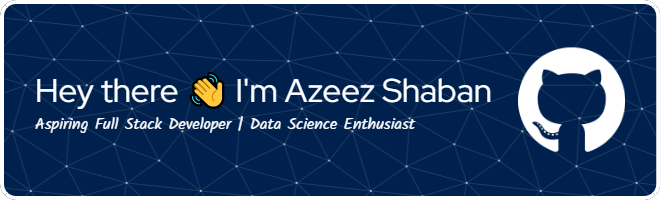

  

 

  

---

## 👨‍💻 About Me  

- 🎓 Computer Science Undergraduate at University of Kelaniya

- 💻 Passionate full-stack developer focusing on MERN stack & Next. js

- 🌱 Exploring cloud computing, data engineering, and AI-powered applications

- 🚀 Building scalable web apps with modern tools like React, Node.js, MongoDB, and Flask

- ✨ Strong interest in combining data, AI, and web technologies to solve real-world problems

- 📬 Reach me at: azeezshaban123@gmail.com

---

## 🛠️ Languages & Tools  

### 🌐 Frontend  

### ⚙️ Backend  

### 🗄️ Databases  

### 🤖 Data Science / AI Tools  

### ☁️ DevOps & Tools  

---

## 📫 Contact & Collaboration  

Open to professional opportunities, collaborations, and contributions in **Full-Stack Web Development, Cloud Computing, and AI-driven applications**.  

  
  
  

Feel free to connect for **technical discussions, project collaborations, or professional inquiries**.  

---

## 📊 GitHub Stats  

  
  

  

